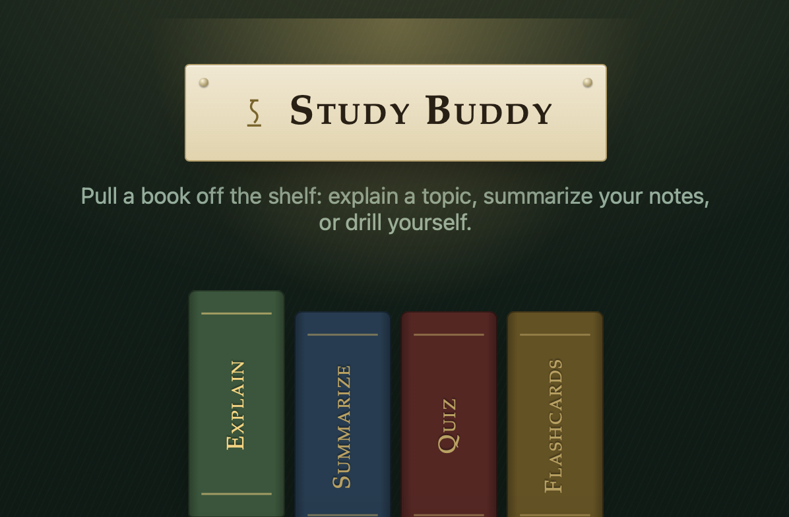
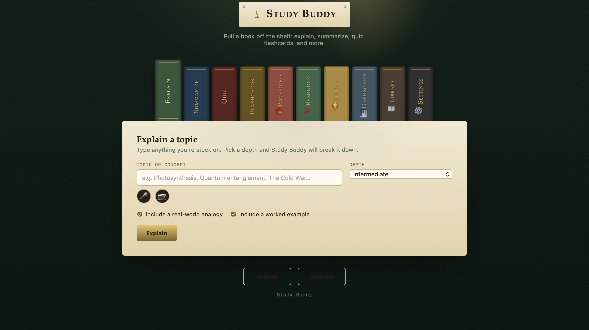
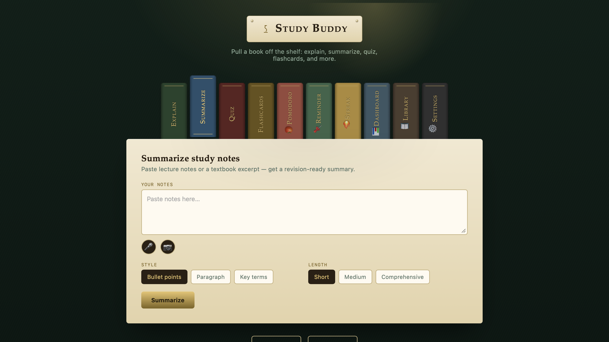
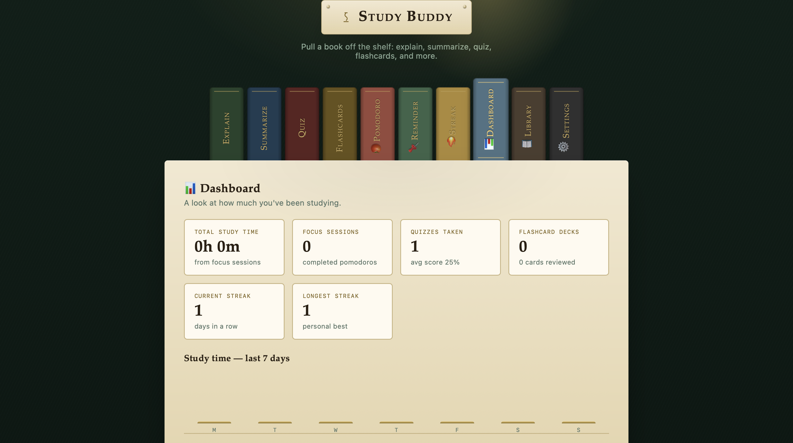
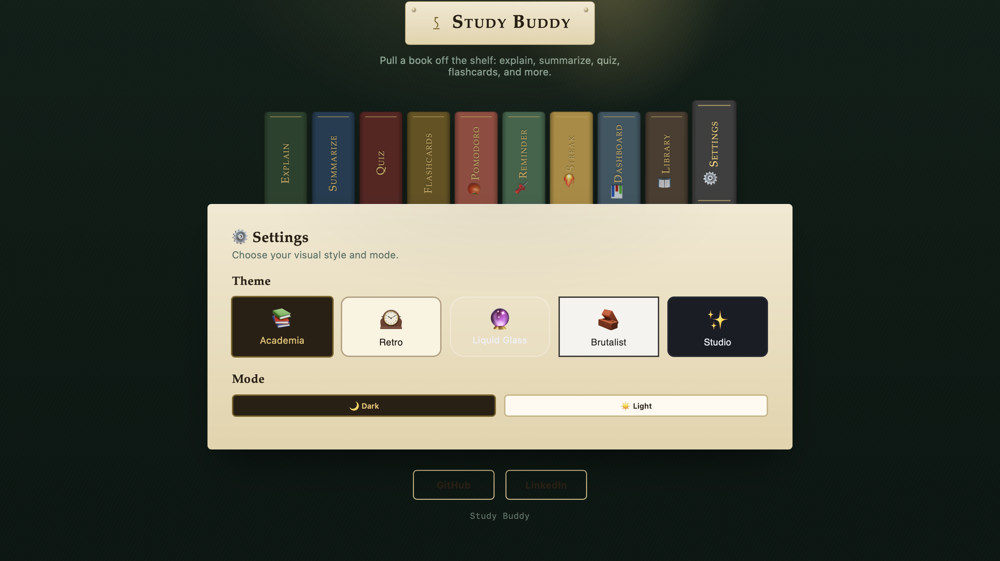

```
  ░██████   ░██████████░██     ░██ ░███████   ░██     ░██    ░████████   ░██     ░██ ░███████   ░███████   ░██     ░██ 
 ░██   ░██      ░██    ░██     ░██ ░██   ░██   ░██   ░██     ░██    ░██  ░██     ░██ ░██   ░██  ░██   ░██   ░██   ░██  
░██             ░██    ░██     ░██ ░██    ░██   ░██ ░██      ░██    ░██  ░██     ░██ ░██    ░██ ░██    ░██   ░██ ░██   
 ░████████      ░██    ░██     ░██ ░██    ░██    ░████       ░████████   ░██     ░██ ░██    ░██ ░██    ░██    ░████    
        ░██     ░██    ░██     ░██ ░██    ░██     ░██        ░██     ░██ ░██     ░██ ░██    ░██ ░██    ░██     ░██     
 ░██   ░██      ░██     ░██   ░██  ░██   ░██      ░██        ░██     ░██  ░██   ░██  ░██   ░██  ░██   ░██      ░██     
  ░██████       ░██      ░██████   ░███████       ░██        ░█████████    ░██████   ░███████   ░███████       ░██     
                                                                                                                       
                                                                                                                       
                                                                                                                       
```


<div align="center">

<div align="center">



**Pull a "book" off the shelf and let AI do the tutoring — plus Pomodoro, reminders, streak tracking, and a choice of five visual themes.**

[](./LICENSE)
[](.)
[](.)
[](.)
[](https://flask.palletsprojects.com/)
[](https://groq.com)
[](https://render.com)

[**📖 Try It**](https://study-buddy-3xji.onrender.com/) &nbsp;·&nbsp; [**🐛 Report Bug**](https://github.com/ayuuXploits/Study-Buddy/issues/new?labels=bug&title=%5BBug%5D+) &nbsp;·&nbsp; [**✨ Request Feature**](https://github.com/ayuuXploits/Study-Buddy/issues/new?labels=enhancement&title=%5BFeature%5D+)

<br/>

*No sign-up. No app to install. Paste a topic or your notes, get explanations, summaries, quizzes, flashcards – plus a Pomodoro timer, reminders, a study streak, and five visual themes to study in.*


</div>
<br/>

 &nbsp; 
 &nbsp; 

</div>

---

## ✨ Features

### 🕯️ Eight “Books” on the Shelf
Click a spine to switch modes — each one is its own self-contained study tool.

| Mode | What it does |
|----|---|
| **Explain** | Breaks a topic down at Simple (ELI5), Intermediate, or Advanced depth |
| **Summarize** | Condenses pasted notes into bullets, a paragraph, or key terms + definitions |
| **Quiz** | Writes a multiple-choice quiz and grades you instantly, with explanations |
| **Flashcards** | Builds a flip-card deck you can browse and export to Markdown |
| **Pomodoro** | Customizable work/break timer with notifications |
| **Reminders** | Add, toggle, and delete tasks – all stored locally |
| **Study Streak** | Log your study sessions daily – the counter grows if you keep the habit |
| **Settings** | Choose your theme (Academia, Retro, Liquid Glass, Brutalist, Studio) and Light/Dark mode |

### 🎚️ Tunable Output
- **Explain** — toggle a real-world analogy and a worked example on or off
- **Summarize** — pick style (bullets / paragraph / key terms) and length (short / medium / comprehensive)
- **Quiz** — 3–8 questions, easy / medium / hard difficulty
- **Flashcards** — 5–12 cards, concise or detailed answers
- **Pomodoro** — adjust work and break durations
- **Theme** — pick a visual style (Academia, Retro, Liquid Glass, Brutalist, Studio) and switch between Light and Dark mode

### 🃏 Interactive, Not Just Text
- Quiz answers are checked live in the browser — correct/incorrect states, a running score, and a short explanation per question
- Flashcards flip in 3D on click, with prev/next navigation and one-click Markdown export
- Explanations and summaries render straight from Markdown (headers, bold, lists) with no page reload
- Pomodoro timer ticks down, switches phases, and sends browser notifications
- Reminders are persisted in your browser’s local storage

### 🎨 Fully Themed
- Five distinct themes — **Academia** (default), **Retro**, **Liquid Glass**, **Brutalist**, and **Studio** — that change colours, fonts, border radii, shadows, and even layout details (Studio swaps the book-spine tabs for a flat pill nav bar)
- Light and Dark mode per theme, saved in `localStorage`
- Keyboard-accessible tabs (arrow keys + Enter/Space), visible focus rings, and `prefers-reduced-motion` support baked in
- Smooth animations on panel switches, hover states, and theme transitions

---

## 🛠️ Tech Stack

| Layer | Technology |
|---|----|
| **Structure** | HTML5 (single file) |
| **Styling** | CSS3 — custom properties, backdrop‑filter, 3D transforms, animations |
| **Logic** | Vanilla JavaScript (ES6+) — no React, no build step |
| **AI Backend** | [Groq](https://groq.com) API (openai/gpt-oss-120b), called through a Flask proxy |
| **Proxy** | [Flask](https://flask.palletsprojects.com/) + `flask-cors`, served by `gunicorn` |
| **Hosting** | [Render](https://render.com) (or any host that runs a Python web service) |
| **Persistence** | `localStorage` for Pomodoro settings, Reminders, Streak data, Theme and Mode preferences |

No bundler. No frontend build step. The whole UI loads straight from one `.html` file; Flask just serves it and proxies the Groq calls.

---

## 🗂️ Project Structure

```

Study-Buddy/
├──.github
│   └── workflows
│       └── keep-alive.yml 
├── docs
│   └── study-buddy.png
│       ├──IMG1.png
│       ├──IMG2.png
│       ├──IMG3.png
│       └──IMG4.png
├── templates
│   └── index.html
├── .gitattributes
├── README.md
├── app.py
├── requirements.txt
├── LICENSE
└── .gitignore
```

---

## 🚀 Getting Started

### Prerequisites
- A modern browser
- Python 3.9+
- A [Groq API key](https://console.groq.com) — read only by the Flask backend, never exposed to the browser

### 1. Clone the repository

```bash
git clone https://github.com/ayuuXploits/Study-Buddy.git
cd Study-Buddy

```

### 2. Install dependencies

```bash
pip install -r requirements.txt


```

`requirements.txt`:


```
flask
flask-cors
requests
gunicorn

```

### 3. Set your Groq API key

```bash

export GROQ_API_KEY=your_key_here     # macOS/Linux
set GROQ_API_KEY=your_key_here        # Windows (cmd)


```

`app.py` reads it from the environment and never hardcodes it — the same variable name works locally and on Render.

### 4. Run it

```bash
python app.py

```

The app serves `templates/index.html` and exposes the proxy at:

| | |
|---|---|
| **Endpoint** | `POST /api/groq` |
| **Accepts** | JSON body `{ "system": "...", "user": "..." }` |
| **Returns** | JSON body `{ "content": "..." }` |
| **Model** | `llama-3.3-70b-versatile` via the Groq Chat Completions API |

Open `http://localhost:5000` and start studying.

---

## ☁️ Deploying to Render

1. Push the repo to GitHub.
2. In Render, create a **new Web Service** from the repo.
3. **Build command:**
   ```bash
   pip install -r requirements.txt
   
   ```
4. **Start command:**
   ```bash
   gunicorn app:app
   
   ```
5. Add an environment variable `GROQ_API_KEY` with your key under the service's **Environment** tab.
6. Deploy — Render gives you a `https://your-app.onrender.com` URL. That's your live proxy + frontend in one.

> Prefer a split setup (static frontend + separate API host)? Point the frontend's fetch call at whatever URL you deploy `app.py` to — Vercel, Netlify Functions, Railway, Fly.io, or a plain VPS all work the same way, as long as they expose the `POST /api/groq` contract above.

---

## 📖 Usage Guide

| Panel | Input | Output |
|---|---|---|
| Explain | A topic name | Plain-language explanation with optional analogy + example |
| Summarize | Pasted notes | Bullets / paragraph / key-terms summary, downloadable as `.md` |
| Quiz | Topic or notes | Interactive multiple-choice quiz with live scoring |
| Flashcards | Topic or notes | Flippable card deck, exportable to `.md` |

---

## 🧑‍💻 Development Notes

- **Single AI chokepoint** — every feature funnels through one `callAI(system, user)` function on the frontend, which POSTs to `/api/groq`, so swapping providers only means changing `app.py` and this one contract.
- **Defensive JSON parsing** — `extractJson()` strips stray code fences and locates the `{...}` block before parsing, since LLMs don't always return perfectly clean JSON for the quiz/flashcard prompts.
- **No framework, manual re-render** — quiz and flashcard state (current question, flipped card, score) live in plain JS variables and get re-rendered by rebuilding an HTML string on each change.
- **Hand-rolled Markdown** — `renderMarkdown()` converts headers, bold, italics, and lists to HTML for the Explain/Summarize output, avoiding a Markdown library dependency.
- **Themed by CSS custom properties** — every theme (including the default Academia look) is a block of CSS variables switched via `data-theme`/`data-mode` attributes on `<html>`; adding a new theme means adding one variable block, not touching component markup.

---

## 📄 License

**Copyright © 2026 ayuuXploits. All rights reserved.**

Licensed under the [MIT License](./LICENSE).

---

<div align="center">

Built with ❤️ by [ayuuXploits](https://github.com/ayuuXploits)

</div>
