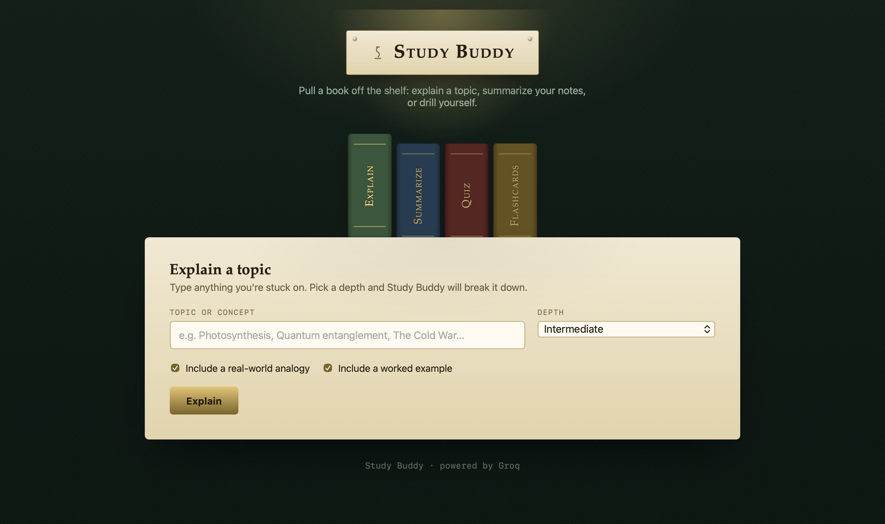

```
  ░██████   ░██████████░██     ░██ ░███████   ░██     ░██    ░████████   ░██     ░██ ░███████   ░███████   ░██     ░██ 
 ░██   ░██      ░██    ░██     ░██ ░██   ░██   ░██   ░██     ░██    ░██  ░██     ░██ ░██   ░██  ░██   ░██   ░██   ░██  
░██             ░██    ░██     ░██ ░██    ░██   ░██ ░██      ░██    ░██  ░██     ░██ ░██    ░██ ░██    ░██   ░██ ░██   
 ░████████      ░██    ░██     ░██ ░██    ░██    ░████       ░████████   ░██     ░██ ░██    ░██ ░██    ░██    ░████    
        ░██     ░██    ░██     ░██ ░██    ░██     ░██        ░██     ░██ ░██     ░██ ░██    ░██ ░██    ░██     ░██     
 ░██   ░██      ░██     ░██   ░██  ░██   ░██      ░██        ░██     ░██  ░██   ░██  ░██   ░██  ░██   ░██      ░██     
  ░██████       ░██      ░██████   ░███████       ░██        ░█████████    ░██████   ░███████   ░███████       ░██     
                                                                                                                       
                                                                                                                       
                                                                                                                       
```

<div align="center">

# 📚 Study Buddy

**Pull a "book" off the shelf and let AI do the tutoring.**

[](./LICENSE)
[](.)
[](.)
[](.)
[](https://groq.com)
[](https://vercel.com)

[**📖 Try It**](https://ayuuxploits.github.io/study-buddy/) &nbsp;·&nbsp; [**🐛 Report Bug**](https://github.com/ayuuXploits/Study-Buddy/issues/new?labels=bug&title=%5BBug%5D+) &nbsp;·&nbsp; [**✨ Request Feature**](https://github.com/ayuuXploits/Study-Buddy/issues/new?labels=enhancement&title=%5BFeature%5D+)

<br/>

*No sign-up. No app to install. Paste a topic or your notes, and get an explanation, a summary, a quiz, or a flashcard deck.*

</div>
<br/>

 &nbsp; 
 &nbsp; 

</div>

---

## ✨ Features

### 🕯️ Four Books on the Shelf
Click a spine to switch modes — each one is its own self-contained study tool.

| Mode | What it does |
|---|---|
| **Explain** | Breaks a topic down at Simple (ELI5), Intermediate, or Advanced depth |
| **Summarize** | Condenses pasted notes into bullets, a paragraph, or key terms + definitions |
| **Quiz** | Writes a multiple-choice quiz and grades you instantly, with explanations |
| **Flashcards** | Builds a flip-card deck you can browse and export to Markdown |

### 🎚️ Tunable Output
- **Explain** — toggle a real-world analogy and a worked example on or off
- **Summarize** — pick style (bullets / paragraph / key terms) and length (short / medium / comprehensive)
- **Quiz** — 3–8 questions, easy / medium / hard difficulty
- **Flashcards** — 5–12 cards, concise or detailed answers

### 🃏 Interactive, Not Just Text
- Quiz answers are checked live in the browser — correct/incorrect states, a running score, and a short explanation per question
- Flashcards flip in 3D on click, with prev/next navigation and one-click Markdown export
- Explanations and summaries render straight from Markdown (headers, bold, lists) with no page reload

---

## 🛠️ Tech Stack

| Layer | Technology |
|---|---|
| **Structure** | HTML5 (single file) |
| **Styling** | CSS3 — custom properties, 3D flip transforms, no framework |
| **Logic** | Vanilla JavaScript (ES6+) — no React, no build step |
| **AI Backend** | [Groq](https://groq.com) API, called through a serverless proxy |
| **Hosting** | Vercel (or any static host) |
| **Persistence** | None client-side — nothing is saved between sessions |

No bundler. No `npm install` for the frontend. Everything loads straight from one `.html` file.

---

## 🗂️ Project Structure

```
Study-Buddy/
├── index.html   # Entire app — markup, styles, and logic
├── README.md
├── LICENSE
└── .gitignore
```

---

## 🚀 Getting Started

### Prerequisites
- A modern browser
- A [Groq API key](https://console.groq.com) — used by your proxy, never by the browser directly

### 1. Clone the repository

```bash
git clone https://github.com/ayuuXploits/Study-Buddy.git
cd Study-Buddy
```

### 2. Point it at a proxy

`index.html` calls a backend proxy so the Groq key never reaches the browser:

```js
const PROXY_URL = 'https://study-buddy-olive-two.vercel.app/api/groq';
```

Deploy your own serverless function (Vercel, Netlify, Cloudflare Workers, etc.) that:

| | |
|---|---|
| **Accepts** | `POST` with JSON body `{ "system": "...", "user": "..." }` |
| **Returns** | JSON body `{ "content": "..." }` |
| **Reads** | Your `GROQ_API_KEY` from an environment variable, never hardcoded |

Then update `PROXY_URL` to point at it.

### 3. Run it

```bash
open index.html
```

Or serve it locally:

```bash
npx serve .
```

### 4. Study

1. Pick a spine — **Explain**, **Summarize**, **Quiz**, or **Flashcards**.
2. Type a topic or paste your notes.
3. Adjust the depth/style/difficulty controls.
4. Generate — then take the quiz or flip through the deck right there on the page.

---

## 📖 Usage Guide

| Panel | Input | Output |
|---|---|---|
| Explain | A topic name | Plain-language explanation with optional analogy + example |
| Summarize | Pasted notes | Bullets / paragraph / key-terms summary, downloadable as `.md` |
| Quiz | Topic or notes | Interactive multiple-choice quiz with live scoring |
| Flashcards | Topic or notes | Flippable card deck, exportable to `.md` |

---

## 🧑‍💻 Development Notes

- **Single AI chokepoint** — every feature funnels through one `callAI(system, user)` function, so swapping providers only means changing the proxy and this one contract.
- **Defensive JSON parsing** — `extractJson()` strips stray code fences and locates the `{...}` block before parsing, since LLMs don't always return perfectly clean JSON for the quiz/flashcard prompts.
- **No framework, manual re-render** — quiz and flashcard state (current question, flipped card, score) live in plain JS variables and get re-rendered by rebuilding an HTML string on each change.
- **Hand-rolled Markdown** — `renderMarkdown()` converts headers, bold, italics, and lists to HTML for the Explain/Summarize output, avoiding a Markdown library dependency.

---

## 📄 License

**Copyright © 2026 ayuuXploits. All rights reserved.**

Licensed under the [MIT License](./LICENSE).

---

<div align="center">

Built with ❤️ by [ayuuXploits](https://github.com/ayuuXploits)

</div>
